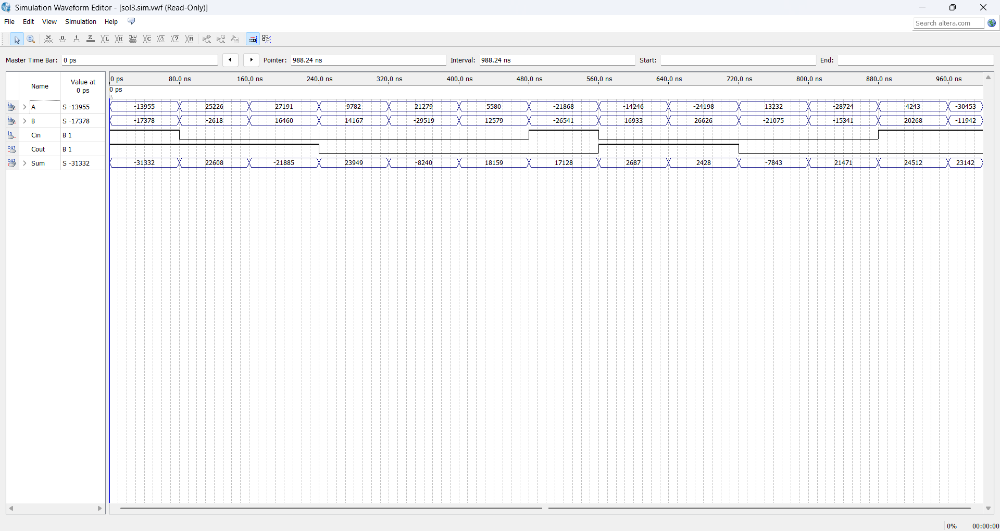

# گزارش طراحی و شبیه‌سازی جمع‌کننده ۱۶ بیتی Manchester

## مشخصات پروژه

* **عنوان**: طراحی و پیاده‌سازی جمع‌کننده‌ی ۱۶ بیتی با استفاده از زنجیره‌ی Manchester
* **ابزار مورد استفاده**:

  * Quartus Prime (برای سنتز و طراحی سخت‌افزاری)
  * ModelSim / Simulation Waveform Editor (برای شبیه‌سازی)
* **زبان طراحی**: Verilog HDL

---

## منطق طراحی (Manchester Carry Chain)

### تعریف:

در طراحی جمع‌کننده‌های سریع، برای کاهش تأخیر انتشار سیگنال‌ها از روش‌هایی مثل زنجیره Manchester استفاده می‌شود. در این روش به‌جای محاسبه پیاپی Carryها (مثل ripple-carry)، با کمک سیگنال‌های تولید و انتشار (Generate و Propagate) جمع به‌صورت موازی انجام می‌شود.

### مراحل حل:

1. تعریف سیگنال‌های `P = A ^ B` و `G = A & B`
2. مقداردهی اولیه به `C[0] = Cin`
3. تولید زنجیره نقلی از طریق فرمول:

   `C[i+1] = G[i] | (P[i] & C[i])`
4. محاسبه `Sum = P ^ C`
5. خروجی `Cout = C[15]`

این روش باعث افزایش سرعت محاسبه جمع در مقایسه با جمع‌کننده‌های سنتی می‌شود.

---

## ساختار ماژول‌ها

### 1. XOR Gate (با استفاده از primitiveهای پایه)

```verilog
module xor_gate (output Y, input A, B);
  wire nA, nB, AandnB, nAandB;
  not (nA, A);
  not (nB, B);
  and (AandnB, A, nB);
  and (nAandB, nA, B);
  or (Y, AandnB, nAandB);
endmodule
```

### 2. NOT Gate با PMOS/NMOS

```verilog
module not_gate(output Y, input A);
  supply1 Vdd;
  supply0 Gnd;
  pmos (Y, Vdd, A);
  nmos (Y, Gnd, A);
endmodule
```

### 3. Manchester Carry Chain Adder 16-bit

```verilog
module manchester_adder (
    input  [15:0] A, B,
    input        Cin,
    output [15:0] Sum,
    output       Cout
);
  wire [15:0] P, G, C;
  assign P = A ^ B;
  assign G = A & B;
  assign C[0] = Cin;

  genvar i;
  generate
    for (i = 0; i < 15; i = i + 1) begin : gen_carry
      assign C[i+1] = G[i] | (P[i] & C[i]);
    end
  endgenerate

  assign Sum = P ^ C;
  assign Cout = C[15];
endmodule
```

### 4. تاپ‌لول برای اتصال به FPGA

```verilog
module top (
    input  [15:0] A,
    input  [15:0] B,
    input        Cin,
    output [15:0] Sum,
    output        Cout
);
  manchester_adder u_adder (
    .A(A), .B(B), .Cin(Cin), .Sum(Sum), .Cout(Cout)
  );
endmodule
```

### 5. Testbench برای شبیه‌سازی

```verilog
module tb;
  reg [15:0] A, B;
  reg Cin;
  wire [15:0] Sum;
  wire Cout;

  manchester_adder uut (
    .A(A), .B(B), .Cin(Cin), .Sum(Sum), .Cout(Cout)
  );

  initial begin
    $monitor("A=%h B=%h Cin=%b => Sum=%h Cout=%b", A, B, Cin, Sum, Cout);

    A = 16'hAAAA; B = 16'h5555; Cin = 0; #10;
    A = 16'h1234; B = 16'h4321; Cin = 0; #10;
    A = 16'hFFFF; B = 16'h0001; Cin = 0; #10;
    A = 16'h0000; B = 16'h0000; Cin = 1; #10;
    $finish;
  end
endmodule
```

---

## نتیجه شبیه‌سازی

شکل موج خروجی شبیه‌سازی به درستی حاصل جمع و بیت نقلی را نمایش می‌دهد.
در تمام تست‌ها، خروجی `Sum` و `Cout` با انتظار منطقی جمع A و B و Cin مطابقت دارند.

### 📷 تصویر خروجی:



### تحلیل نمونه‌ها از تصویر شبیه‌سازی:

| زمان (ns) | A      | B      | Cin | Sum    | Cout | توضیح                      |
| --------- | ------ | ------ | --- | ------ | ---- | -------------------------- |
| 0         | -13955 | -17378 | 1   | -31332 | 1    | جمع منفی با carry-in = 1   |
| 240       | 27191  | 16460  | 0   | 23949  | 1    | overflow → Cout = 1        |
| 640       | -24198 | 26626  | 0   | 2428   | 0    | جمع مثبت در محدوده صحیح    |
| 800       | 4243   | 20268  | 1   | 24512  | 1    | جمع با carry-in → Cout = 1 |

---

## نتیجه‌گیری

این پروژه نشان می‌دهد که با استفاده از منطق ساده‌ی ترکیبی و زنجیره‌ی Manchester، می‌توان یک جمع‌کننده‌ی ۱۶ بیتی سریع و دقیق طراحی کرد. این مدار برای پیاده‌سازی‌های واقعی در FPGA قابل استفاده بوده و عملکرد آن در شبیه‌سازی نیز به خوبی تایید شد.
